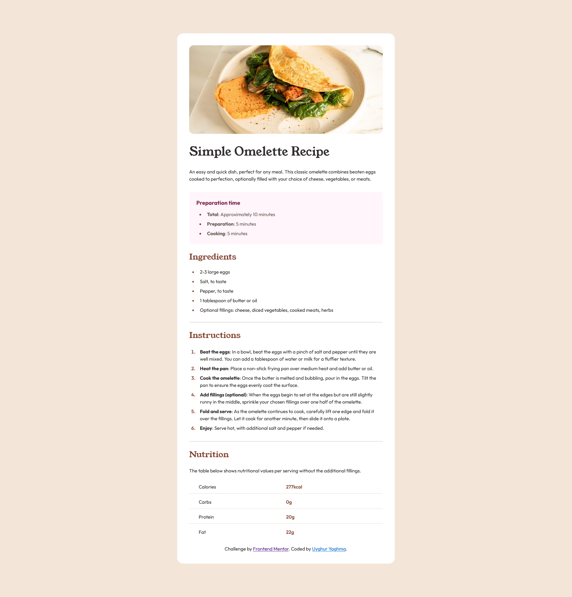

# Frontend Mentor - Recipe page solution

This is a solution to the [Recipe page challenge on Frontend Mentor](https://www.frontendmentor.io/challenges/recipe-page-KiTsR8QQKm). 

## Table of contents

- [Overview](#overview)
  - [Screenshot](#screenshot)
  - [Links](#links)
- [My process](#my-process)
  - [Built with](#built-with)
  - [What I learned](#what-i-learned)
  - [Useful resources](#useful-resources)
- [Author](#author)
- [Acknowledgments](#acknowledgments)

## Overview

### Screenshot



### Links

- Solution URL: [Repository](https://github.com/uyaghma/RecipePage)
- Live Site URL: [Live Site](https://uyaghma.github.io/RecipePage/)

## My process

### Built with

- Semantic HTML5 markup
- CSS custom properties

### What I learned
Learned how to import fonts into CSS stylesheet using a link to the .ttf file.

```css
@font-face {
    font-family: 'Outfit';
    src: url("./assets/fonts/outfit/Outfit-VariableFont_wght.ttf") format("truetype");
}

@font-face {
    font-family: "Young Serif";
    src: url("./assets/fonts/young-serif/YoungSerif-Regular.ttf") format("truetype");
}
```

### Useful resources

- [Stack Overflow](https://stackoverflow.com/) - Helped me with styling ordered and unordered list items and markers.

## Author

- Frontend Mentor - [@uyaghma](https://www.frontendmentor.io/profile/uyaghma)